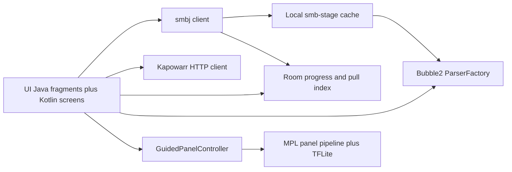

# Cupcake Comics — Implementation-Ready Specification (v1)

**Status:** Approved 2026-07-15 (human)  
**Map:** [Cupcake Comics Wayfinding](../maps/cupcake-comics-wayfinding.md)  
**Date:** 2026-07-15

Build handoff started the same day: Bubble2 forked locally, Android Studio + wireless ADB on Pixel 6, debug APK install path verified.

## 1. Product summary

Cupcake Comics is a modern-Android fork of [Bubble2](https://github.com/edeso/bubble2) that keeps Bubble2’s local archive reader while adding:

- Samba (SMB) library browsing and reading
- Virtual Pull List over user-monitored folders
- Kapowarr request integration
- Optional Guided Panel reading adapted from [Chika](https://github.com/batunii/chika)
- Left/up swipe to next page when Guided Panel is off

## 2. Identity & platform

| Item | Decision |
| --- | --- |
| Display name | Cupcake Comics |
| applicationId | `com.cupcakecomics.app` |
| Upstream Java package | Keep `com.nkanaev.comics` |
| New Kotlin package | `com.cupcakecomics.*` |
| minSdk / target / compile | 30 / 35 / **36** (compileSdk 36 required by AndroidX Activity 1.11+; runtime target remains 35) |
| License host | GPL-3.0 (Bubble2 obligations) |

## 3. Architecture

**Keep as Java:** parsers, `Scanner`, `ReaderFragment`/`PageImageView`, `Storage` until Room wrap.  
**Add Kotlin:** SMB, Kapowarr, Room façades, WorkManager, panel modules, GuidedPanelController.

## 4. Kapowarr

- Store `base_url` + `api_key` in EncryptedSharedPreferences
- Probe: `POST /api/auth/check` or `GET /api/system/about`
- Flow: `GET /api/rootfolder` → `GET /api/volumes/search` → `POST /api/volumes` with `auto_search: true`
- Optional: `POST /api/system/tasks` `{cmd:auto_search, volume_id}`
- LAN HTTP allowed after one-time ack; map errors to stable UI codes

## 5. SMB & staging

- Library: hierynomus smbj, read-only
- Browse/scan: metadata only
- Open comic: stage current file into `cache/smb-stage/…` then `ParserFactory`
- Caps: 2 staged comics; ≤2 GiB or 20% free
- **Never** mutate/symlink server files for Pull List

## 6. Pull List

- Identity: `shareId + relativePath`
- First enroll of a monitored folder = baseline (no flood of “new”)
- Later scans: newly seen comic paths enter Pull List
- WorkManager every 30 minutes on Wi‑Fi + manual refresh
- Notifications ON by default (toggle off in Settings)
- Leave list when `highestPageIndex / pageCount ≥ 0.90` or Mark Read
- Mark Unread restores entry

## 7. Reader & panels

- Guided Panel optional
- OFF: swipe left or up → next page
- ON: swipe advances panel slots then pages; pinch/pan until edge
- Adapt Chika MPL pipeline + TFLite model; no Chika branding
- Direction from Bubble2 LTR/RTL setting

## 8. Product IA

Tabs: **Pull List (home)** · Library · Request · Settings (Connections, notifications, About)

Prototype: [006-product-flow-prototype.md](../assets/006-product-flow-prototype.md)

## 9. Build phases (post-approval)

1. Clone Bubble2 into workspace; rebrand applicationId/name; set SDKs; reproducible debug build
2. Room + encrypted connection profiles
3. SMB browse + stage + open
4. Pull List index, WorkManager, notifications
5. Kapowarr client + Request UI
6. Panel engine + Guided Panel + left/up page swipe
7. Wireless ADB device validation against acceptance matrix
8. License/About notices + release packaging

## 10. Acceptance (v1 done)

- Wireless debug install on user’s Android 11+ phone
- Open CBZ/CBR from SMB
- Kapowarr search + add + auto_search succeeds
- New file in monitored folder appears on Pull List; ≥90% removes it
- Guided Panel works offline; left/up page swipe works with guided off
- No server file mutation; API keys never logged

## 11. Out of scope (v1)

Full Kapowarr admin, iOS, server-side pull folders/symlinks, Chika brand kit, Android 5–10 support, Kerberos SMB, true random-access SMB parsing without staging.
