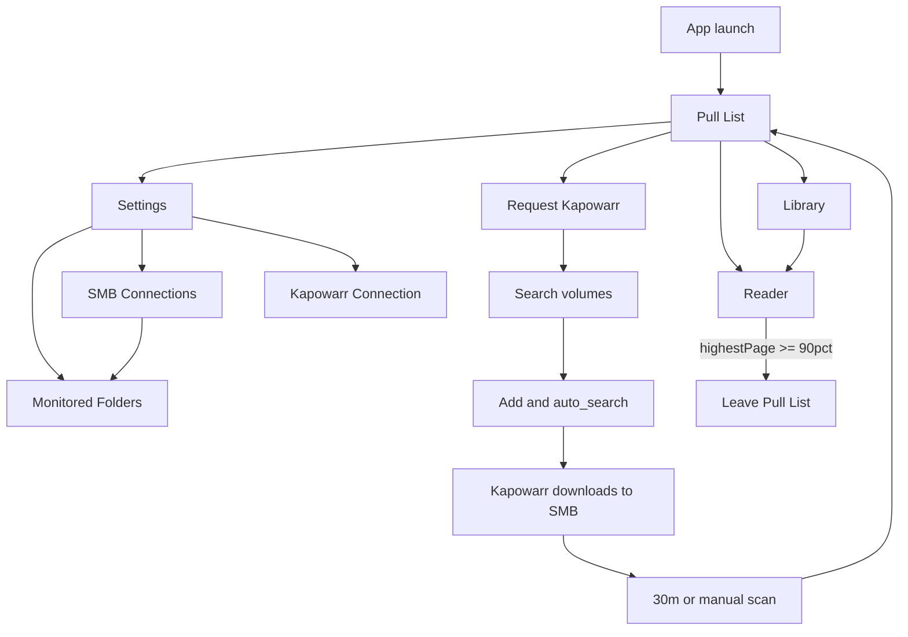

# Cupcake Comics — Product Flow Prototype (v1)

Asset for ticket [Approve the product flow](../tickets/006-approve-the-product-flow.md).

## Primary navigation

Bottom or drawer nav (phone-first):

1. **Pull List** (home) — unread new arrivals  
2. **Library** — browse connected SMB paths + local library (Bubble2 heritage)  
3. **Request** — Kapowarr search/add  
4. **Settings** — connections, notifications, reading prefs  

## Screen map

### Connections (Settings → Connections)

- **SMB shares:** Add share (host, share, path, user/pass or guest) → Test → Save  
- **Monitored folders:** After share works, pick folders for Pull List monitoring  
- **Kapowarr:** Base URL + API key → Test (`/api/auth/check`) → Save; show version from `/api/system/about`  
- LAN HTTP acknowledgment dialog once per HTTP Kapowarr/SMB profile  

### Library

- Tree/list of saved SMB roots + Bubble2 local library entries  
- Open comic → stages then Reader  
- Long-press: ignore from Pull List / mark read / mark unread  

### Pull List

- List of unread items discovered after folder baseline  
- Badge = count  
- Tap → Reader  
- Empty state: “Nothing new — monitoring N folders”  
- Pull-to-refresh forces scan  

### Request (Kapowarr)

1. Search query  
2. Results (cover, year, issues, “Already added” chip)  
3. Pick root folder if multiple  
4. Monitor scheme: All / Missing / None; monitor new issues toggle; auto-search ON by default  
5. Confirm → success toast (“Queued in Kapowarr”)  

### Reader

- Bubble2 page viewer + zoom/pan  
- Settings / chrome: **Guided Panel** toggle  
- Guided OFF: swipe left or up → next page (product lock)  
- Guided ON: swipe advances panel slots, then page  
- Progress writes highest page index; ≥90% removes from Pull List  

### Notifications & settings

- “New Pull List issues” toggle (default ON)  
- Scan interval display (30 min Wi‑Fi)  
- Reading direction LTR/RTL (existing Bubble2)  
- About: GPL + MPL panel notices + model attribution  

## Flow diagram

## Non-goals in v1 UI

- Kapowarr admin/settings editing  
- Server-side pull folders / symlinks  
- Chika branding  
- Multi-user accounts  
