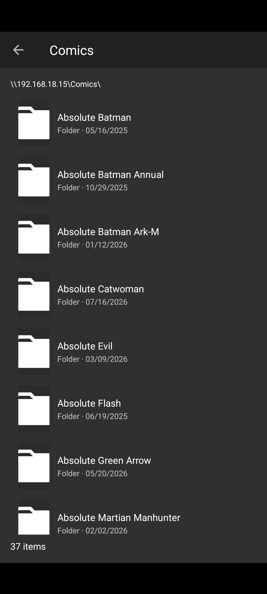

# Cupcake Comics feedback — 20260719_190400

> Paste this file (and the PNG if present) into Cursor when reporting a bug or asking for a change.

## Context

- **Time:** 2026-07-19 19:04:00 -0400
- **App:** com.cupcakecomics.app.debug 0.1.0-DEBUG (1)
- **Activity:** com.nkanaev.comics.activity.MainActivity
- **Title:** Comics
- **Visible fragments:**
  - SmbBrowseFragment args=[shareId]
- **Back stack (1):**
  - 1
- **Intent action:** android.intent.action.MAIN
- **Selected / checked views:**
  - CheckedTextView · id=design_menu_item_text · text="Connections" · checked
- **User note:** (see below)

## Notes

When I successfully connect to my smb share, it should boot me back out to the connections menu

## Screenshot



_File: `feedback_20260719_190400.png`_

## Pull into project

```bat
adb pull /sdcard/Download/CupcakeFeedback/ .\feedback\
```

