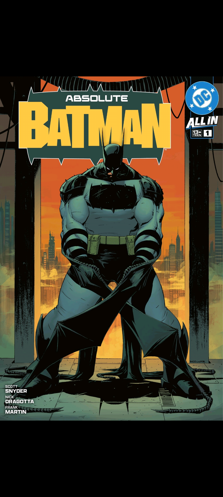

# Cupcake Comics feedback — 20260717_192236

> Paste this file (and the PNG if present) into Cursor when reporting a bug or asking for a change.

## Context

- **Time:** 2026-07-17 19:22:36 -0400
- **App:** com.cupcakecomics.app.debug 0.1.0-DEBUG (1)
- **Activity:** com.nkanaev.comics.activity.ReaderActivity
- **Title:** Cupcake Comics
- **Visible fragments:**
  - CupcakeReaderFragment args=[PARAM_HANDLER, PARAM_IDENTITY_KEY, PARAM_MODE]
- **Intent action:** (none)
- **Intent extras:**
  - `PARAM_HANDLER` = /data/user/0/com.cupcakecomics.app.debug/cache/smb-stage/474ac200d68494e977c865fc/Absolute Batman (2024) Volume 01 Is…
  - `PARAM_IDENTITY_KEY` = smb:1:Absolute Batman/Volume 01 (2024)/Absolute Batman (2024) Volume 01 Issue 001.cbr
  - `PARAM_MODE` = MODE_BROWSER
- **User note:** (see below)

## Notes

There's no exit button when downloading a comic

## Screenshot



_File: `feedback_20260717_192236.png`_

## Pull into project

```bat
adb pull /sdcard/Download/CupcakeFeedback/ .\feedback\
```

