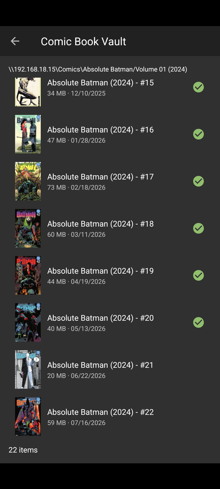

# Cupcake Comics feedback — 20260718_105906

> Paste this file (and the PNG if present) into Cursor when reporting a bug or asking for a change.

## Context

- **Time:** 2026-07-18 10:59:06 -0400
- **App:** com.cupcakecomics.app.debug 0.1.0-DEBUG (1)
- **Activity:** com.nkanaev.comics.activity.MainActivity
- **Title:** Comic Book Vault
- **Visible fragments:**
  - SmbBrowseFragment args=[shareId]
- **Back stack (1):**
  - 2
- **Intent action:** android.intent.action.MAIN
- **Selected / checked views:**
  - CheckedTextView · id=design_menu_item_text · text="Library" · checked
- **User note:** (see below)

## Notes

There should be a run in background button setting for offline downloads. It should also have a setting for if you want to receive a notif when they're done

## Screenshot



_File: `feedback_20260718_105906.png`_

## Pull into project

```bat
adb pull /sdcard/Download/CupcakeFeedback/ .\feedback\
```

