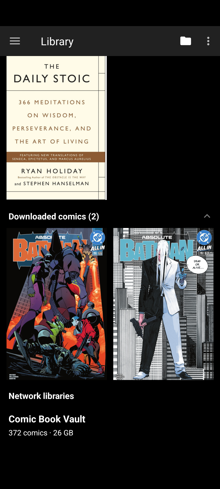

# Cupcake Comics feedback — 20260718_133620

> Paste this file (and the PNG if present) into Cursor when reporting a bug or asking for a change.

## Context

- **Time:** 2026-07-18 13:36:20 -0400
- **App:** com.cupcakecomics.app.debug 0.1.0-DEBUG (1)
- **Activity:** com.nkanaev.comics.activity.MainActivity
- **Title:** Library
- **Visible fragments:**
  - LibraryFragment
- **Intent action:** android.intent.action.MAIN
- **Selected / checked views:**
  - CheckedTextView · id=design_menu_item_text · text="Library" · checked
- **User note:** (see below)

## Notes

Downloaded comics should have a little green checkmark when read, then additionally, the app should allow me to pick up from where I left off with a comic I've already started reading

## Screenshot



_File: `feedback_20260718_133620.png`_

## Pull into project

```bat
adb pull /sdcard/Download/CupcakeFeedback/ .\feedback\
```

