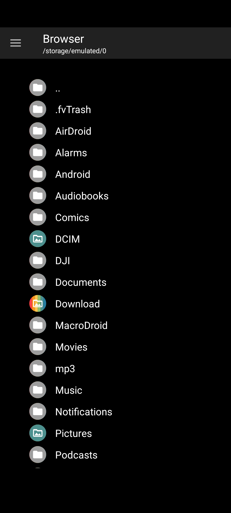

# Cupcake Comics feedback — 20260717_192055

> Paste this file (and the PNG if present) into Cursor when reporting a bug or asking for a change.

## Context

- **Time:** 2026-07-17 19:20:55 -0400
- **App:** com.cupcakecomics.app.debug 0.1.0-DEBUG (1)
- **Activity:** com.nkanaev.comics.activity.MainActivity
- **Title:** Browser
- **Visible fragments:**
  - BrowserFragment
- **Intent action:** (none)
- **Selected / checked views:**
  - CheckedTextView · id=design_menu_item_text · text="Browser" · checked
- **User note:** (see below)

## Notes

Small lag when entering the storage browser

## Screenshot



_File: `feedback_20260717_192055.png`_

## Pull into project

```bat
adb pull /sdcard/Download/CupcakeFeedback/ .\feedback\
```

